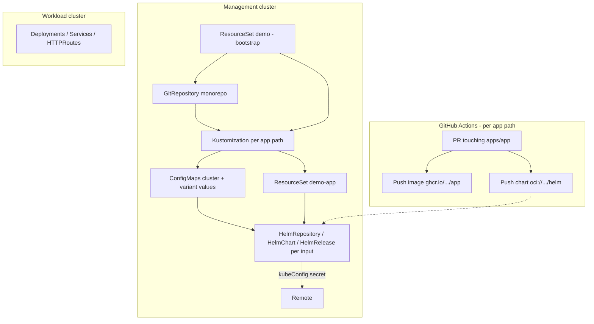

# Demo repo review: Flux hub-and-spoke GitOps (Gladia context)

**Audience:** Platform / infra team evaluating this demo for production  
**Environment:** Management cluster (Sveltos + CAPI) → ~30 workload clusters; **large monorepo with 20+ apps**  
**Demo repo:** Hub Flux on management cluster deploying to remote clusters via `kubeConfig`

---

## 1. Executive summary

This demo implements **hub-and-spoke GitOps**: one Flux stack on the **management cluster** deploys Helm releases to **remote clusters** using per-cluster kubeconfig secrets. Configuration stays in Git; chart artifacts are published to **OCI** by CI.

The pattern aligns with **Flux multi-cluster and Helm best practices**, but the **number of concepts is high** for a small sample app. In a **20+ app monorepo**, complexity shifts from “understanding one app” to **fleet scale, ownership, CI fan-out, and how many `ResourceSet` / `inputs` matrices you maintain**.

| Verdict | Notes |
|--------|--------|
| **Technically sound** | Remote `HelmRelease`, OCI charts, Git-backed values, `valuesFrom`, drift detection, `ResourceSet` for DRY |
| **Feels complicated** | Two `ResourceSet` layers + Kustomize ConfigMaps + CI + blue/green; monorepo multiplies apps, not clusters |
| **Incomplete vs Gladia stack** | No Sveltos/CAPI, kubeconfig bootstrap, or promotion workflow in the demo |
| **Licensing** | `fluxcd.controlplane.io/v1` = **Flux Operator (AGPL-3.0)**; usable without Enterprise subscription; legal review recommended |

---

## 2. Architecture overview

### 2.1 End-to-end flow



### 2.2 Layers in the demo (today: one app)

| Layer | Location | Role |
|--------|----------|------|
| **CI** | `.github/workflows/ci.yaml`, `ci-app.yaml` | Build image + push Helm chart to OCI on PR |
| **Platform bootstrap** | `deploy/flux.yaml` | `ResourceSet` → `GitRepository` + `Kustomization` → `apps/<app>/deploy` |
| **App config (Git)** | `apps/<app>/deploy/clusters/<cluster>/` | Kustomize → ConfigMaps for `valuesFrom` |
| **App delivery (templated)** | `apps/<app>/deploy/flux.yaml` | `ResourceSet` → `HelmRepository` / `HelmChart` / `HelmRelease` per cluster × variant |

### 2.3 What is *not* in the demo

- How the **root** `ResourceSet` (`deploy/flux.yaml`) is first installed on the management cluster  
- Creation/rotation of **`*-kubeconfig`** secrets (likely CAPI / platform automation)  
- **Sveltos** boundaries (what Sveltos deploys vs what Flux deploys)  
- **Promotion** after merge to `main` (CI is PR-triggered only in the sample)  
- **Monorepo** wiring for 20+ apps (only `app` is shown)

---

## 3. Flux patterns used (and why the teammate is right)

These match documented Flux practices for fleet / Helm GitOps:

1. **Remote clusters via `HelmRelease.spec.kubeConfig`**  
   Hub reconciles against worker API servers using secrets (e.g. `gladia-eu-200-kubeconfig`). Standard when Flux is not installed on every spoke.

2. **OCI Helm repository**  
   CI pushes to `oci://ghcr.io/.../helm`; cluster uses `HelmRepository` `type: oci`.

3. **Split chart artifact vs environment config**  
   - **Chart / version:** OCI + `HelmChart`  
   - **Per-cluster overrides:** Git → ConfigMaps → `valuesFrom`  

4. **ConfigMap reconciliation**  
   Label `reconcile.fluxcd.io/watch: Enabled` on generated ConfigMaps so value changes trigger Helm upgrades.

5. **`ResourceSet` (Flux Operator) for repetition**  
   Avoids copy-pasting one `HelmRelease` per cluster (and per variant). Important at **30 clusters** and worse with **many apps** if each app duplicates the same pattern.

6. **`dependsOn` in bootstrap `ResourceSet`**  
   Supports ordered rollout when multiple apps depend on each other (`inputs.dependsOn` in root template).

7. **Drift detection on `HelmRelease`**  
   Example: ignore `/spec/replicas` on Deployments when HPA or manual scaling applies.

**Caveat:** This uses **Flux Operator** APIs (`fluxcd.controlplane.io/v1`), not only CNCF GitOps Toolkit controllers. The management cluster must run the **Flux Operator**, not just `flux install`.

---

## 4. Why it feels complicated

1. **Two-stage bootstrap** — Platform `ResourceSet` registers Git + per-app `Kustomization`; app `ResourceSet` materializes Helm objects.  
2. **Namespace = cluster name on the hub** — `HelmRepository` / `HelmChart` live in e.g. `gladia-eu-200` on the management cluster; workloads run in `targetNamespace` on the **remote** cluster (easy to misread).  
3. **Blue/green in demo** — Two `inputs` rows → two `HelmRelease`s per cluster; doubles object count.  
4. **Version pinning split** — Chart constraint in `ResourceSet` inputs (`>=0.0.0-0`); image tag from chart `appVersion` at CI package time; no shown git-based promotion.  
5. **Flux Operator vs “vanilla Flux”** — Extra component and `ResourceSet` templating syntax (`<< inputs.* >>`).  
6. **Monorepo (20+ apps)** — Same patterns repeated per app unless you centralize bootstrap and standardize layout (see §6).

---

## 5. Fit for Gladia: management cluster + Sveltos + CAPI + ~30 clusters

### 5.1 Good fit if you agree on

| Principle | Rationale |
|-----------|-----------|
| **Platform vs apps** | Sveltos/CAPI for cluster lifecycle, addons, policies; Flux for **application** delivery with Git as app config SSOT |
| **One Flux on the hub** | Operational simplicity vs 30× Flux installations |
| **Fleet via templating** | `ResourceSet.inputs` or generated inputs from cluster inventory (CAPI labels, etc.) |
| **Monorepo** | Single `GitRepository`, many app paths — matches demo’s `GitRepository` + per-app `Kustomization` |

### 5.2 Risks to resolve early

| Topic | Question |
|--------|----------|
| **Sveltos overlap** | Will Sveltos still deploy the same Helm/Kustomize objects? Avoid two GitOps controllers on the same resources. |
| **Kubeconfig lifecycle** | Who creates/rotates `<cluster>-kubeconfig` when clusters join/leave? |
| **Scaling `inputs`** | Manual matrix per app × cluster × variant, or generation from cluster registry? |
| **Hub blast radius** | Bad `HelmRelease` or compromised hub affects entire fleet; RBAC and admission on management cluster are critical. |
| **Observability** | Per-app/per-cluster health, alerts, and ownership in a monorepo. |

### 5.3 Object count intuition (order of magnitude)

Without careful design, fleet size grows quickly:

```
HelmReleases (hub) ≈ apps × clusters × variants
```

Example: **20 apps × 30 clusters × 2 variants = 1,200** `HelmRelease` objects reconciled from the hub (plus `HelmChart`, `HelmRepository` per namespace/cluster slice).

That may be acceptable with automation and strong platform standards; it is **not** “simple” without tooling and conventions.

---

## 6. Large monorepo (20+ apps): implications and recommendations

### 6.1 What the demo already hints at (good for monorepo)

- **Reusable CI workflow** — `workflow_call` with `inputs.app` and path filter `apps/app/**` → replicate as `apps/<name>/**` per app.  
- **Per-app directory** — `apps/<app>/` with `charts/`, `deploy/`, `Dockerfile`.  
- **Single Git repo** — One `GitRepository` resource; bootstrap `ResourceSet` can add one `Kustomization` per app (template uses `inputs.app`).  
- **`dependsOn`** — Root bootstrap template supports app ordering for shared dependencies (ingress, CRDs, etc.).

### 6.2 What you should standardize across 20+ apps

| Area | Recommendation |
|------|----------------|
| **Layout** | Fixed contract: `apps/<app>/charts/<app>`, `apps/<app>/deploy/flux.yaml`, `apps/<app>/deploy/clusters/<cluster>/values/` |
| **Bootstrap** | Prefer **one** platform `ResourceSet` / generator that registers **all** apps from a list or directory scan — avoid 20 hand-maintained root manifests |
| **CI** | One callable workflow; per-app workflow file or `paths` matrix; concurrency groups per app (as in demo) |
| **Ownership** | `CODEOWNERS` per `apps/<team>/`; required reviews on `deploy/` and chart bumps |
| **Cluster matrix** | Don’t duplicate 30 cluster rows in every app if identical; consider **shared fleet config** + app-specific values only |
| **Variants** | Use blue/green only where needed; default single release per cluster per app |
| **Versions** | Per-app chart version in git or automation; avoid global `>=0.0.0-0` in production |
| **Promotion** | Document: PR → pre-release chart → merge → pin version in git or approved automation |

### 6.3 Monorepo anti-patterns to avoid

- **20 copies** of nearly identical `deploy/flux.yaml` without a shared template or generator  
- **20 separate `GitRepository`** resources pointing at the same monorepo  
- **Unscoped CI** — any change running build for all apps  
- **Per-app kubeconfig duplication** — cluster secrets should be **platform-owned**, not per-app  
- **Mixing platform and app paths** — keep cluster/addon config under clear roots (e.g. `platform/`, `apps/`)

### 6.4 Suggested monorepo layout (conceptual)

```
/
├── deploy/                    # Platform bootstrap ResourceSet(s)
├── platform/
│   └── clusters/              # Optional: shared cluster registry / kubeconfig refs
└── apps/
    ├── app-a/
    │   ├── charts/app-a/
    │   ├── deploy/
    │   │   ├── flux.yaml      # ResourceSet for app-a fleet inputs
    │   │   ├── kustomization.yaml
    │   │   └── clusters/
    │   └── Dockerfile
    └── app-b/
        └── ...
```

---

## 7. Licensing: `fluxcd.controlplane.io/v1` in enterprise

### 7.1 Short answer

**Yes** — you can use `ResourceSet` and other `fluxcd.controlplane.io/v1` resources in a **large company without paying** for ControlPlane Enterprise, subject to **AGPL-3.0** and internal open-source policy.

**No** — “free” does **not** mean the same as CNCF Flux (Apache 2.0); and **Enterprise for Flux CD** is a separate **paid** offering.

### 7.2 Component breakdown

| Component | License | Subscription required? |
|-----------|---------|-------------------------|
| CNCF Flux controllers (`*.toolkit.fluxcd.io`) | Apache 2.0 | No (public upstream images) |
| **Flux Operator** + **ResourceSet** | **AGPL-3.0** | No fee for OSS build; compliance review typical |
| **ControlPlane Enterprise for Flux CD** | Commercial | Yes — hardened/FIPS images, CVE SLAs, support, private registries |

### 7.3 Maintainer position (as of public statements, 2026)

- **No plan** to remove AGPL features (UI, Flux Operator APIs, ResourceSet) behind a paywall in a “rug pull” sense.  
- **Paid:** enterprise licenses, hardened distribution, specialized add-on components.  
- **ResourceSet** is **v1** and described as production-ready with backward-compatibility expectations for that API.

### 7.4 Practical steps for Gladia

1. **Legal/compliance** — Review AGPL for internal use, modification, and distribution policies.  
2. **Architecture** — Account for **Flux Operator** as a required dependency on the management cluster.  
3. **Procurement** — Budget **Enterprise** only if you need FIPS/hardened images, private CVE-patched builds, or vendor support — not because `ResourceSet` itself is paid today.

*This section is informational, not legal advice.*

---

## 8. Simplifications (team discussion)

1. **Document bootstrap** — What installs `deploy/flux.yaml`; how kubeconfig secrets appear; Sveltos vs Flux boundary.  
2. **Drop blue/green** in the first fleet iteration unless required.  
3. **Tighten chart versions** in git per app/environment.  
4. **Add merge-to-main CI** and a written promotion path.  
5. **Monorepo: one platform generator** for app registration instead of N bootstrap copies.  
6. **Generate or centralize cluster `inputs`** — avoid 20 × 30 manual YAML matrices.

---

## 9. Decision checklist (before fleet-wide adoption)

- [ ] Legal approved **Flux Operator (AGPL)** for our use case  
- [ ] Clear split: **Sveltos** (platform) vs **Flux** (apps)  
- [ ] Kubeconfig secrets automated from **CAPI** (or equivalent)  
- [ ] Monorepo layout and **CODEOWNERS** agreed  
- [ ] CI: path-scoped builds for 20+ apps  
- [ ] Fleet matrix: how `ResourceSet.inputs` are authored (manual vs generated)  
- [ ] Production version pinning and rollback documented  
- [ ] Hub RBAC, audit, and blast-radius accepted  
- [ ] Observability per app / cluster  

---

## 10. References

- [Flux Operator – ResourceSets introduction](https://fluxcd.control-plane.io/operator/resourcesets/introduction/)  
- [ControlPlane Enterprise for Flux CD – distribution](https://fluxcd.control-plane.io/distribution/)  
- [Flux Operator – future plans / licensing discussion (issue #606)](https://github.com/controlplaneio-fluxcd/flux-operator/issues/606)  
- [Flux Operator – enterprise offering](https://fluxoperator.dev/enterprise/)  
- Demo repo paths: `deploy/flux.yaml`, `apps/app/deploy/flux.yaml`, `apps/app/deploy/clusters/`

---

*Document synthesized from architecture review, monorepo fleet considerations, and licensing Q&A.*
